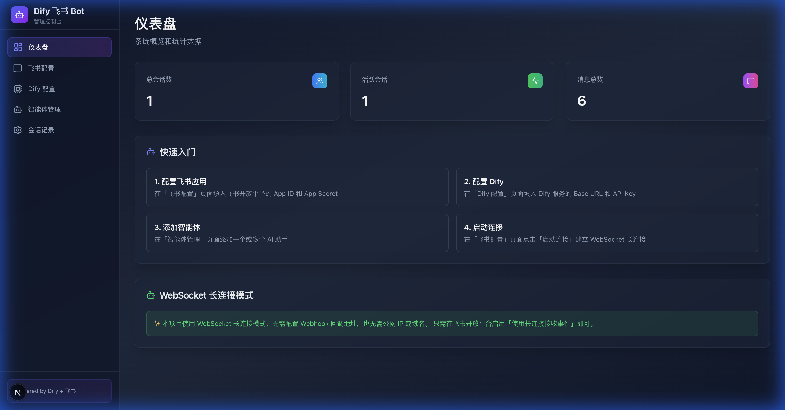
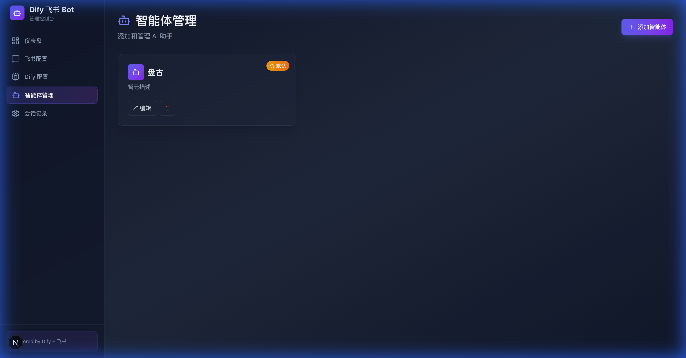

<div align="center">

# 🤖 Dify Feishu Bot

**Seamlessly integrate Dify AI into Feishu (Lark) for intelligent conversations**

[](LICENSE)
[](https://nodejs.org/)
[](https://nextjs.org/)

**English** | [中文](./README.md)

</div>

---

## 📖 About

Dify Feishu Bot is an open-source project that enables seamless integration between [Dify](https://dify.ai/) AI capabilities and Feishu (Lark) messenger. With simple configuration, your Feishu users can have natural conversations with Dify-powered AI agents.

### 🎯 Use Cases

- 🏢 Enterprise internal AI assistant / Knowledge base Q&A
- 📚 Document-based AI helper
- 🤝 Team collaboration AI tools
- 🔧 Custom workflow automation

### 📸 Screenshots

<div align="center">

**Dashboard - System Overview & Quick Start Guide**



**Feishu Configuration - WebSocket Long Connection Mode**


**Dify Configuration - API Connection Settings**


**Agent Management - Multi-Agent Support**



</div>

---

## ✨ Key Features

| Feature | Description |
|---------|-------------|
| 🔌 **WebSocket Connection** | No public IP, domain, or webhook configuration required |
| 🤖 **Multi-Agent Support** | Configure multiple AI agents, users can switch freely |
| 💬 **Session Management** | Automatic context management for multi-turn conversations |
| ⚙️ **Visual Configuration** | Web admin panel for all configurations |
| 🔒 **Secure Access** | Token-based admin panel authentication |
| 📝 **Conversation History** | Complete conversation logs for tracking |

---

## 🏗️ Architecture

```
┌─────────────────┐     WebSocket      ┌─────────────────┐
│  Feishu Client  │ ◄─────────────────► │  Dify Feishu Bot │
└─────────────────┘   Long Connection   └────────┬────────┘
                                                 │
                                                 │ HTTP API
                                                 ▼
                                        ┌─────────────────┐
                                        │   Dify Server   │
                                        │  (Self-hosted)  │
                                        └─────────────────┘
```

**Tech Stack:**
- **Runtime**: Node.js 18+
- **Framework**: Next.js 15 (App Router)
- **Database**: SQLite + Prisma ORM
- **Feishu SDK**: @larksuiteoapi/node-sdk
- **UI**: React + Tailwind CSS

---

## 🚀 Quick Start

### Prerequisites

Before you begin, make sure you have:

- [x] Node.js 18 or higher
- [x] A [Feishu Open Platform](https://open.feishu.cn/) application
- [x] A self-hosted [Dify](https://github.com/langgenius/dify) instance

### Step 1: Clone the Repository

```bash
git clone https://github.com/joshleeeeee/dify-feishu-bot.git
cd dify-feishu-bot
```

### Step 2: Install Dependencies

```bash
npm install
```

### Step 3: Initialize Database

```bash
npx prisma generate
npx prisma db push
```

### Step 4: Configure Environment

Copy the example configuration:

```bash
cp .env.example .env
```

Edit `.env` and set your admin token:

```bash
# Admin panel access token (change to your own secure token)
ADMIN_TOKEN=your-secure-token-here

# Database path (default is fine)
DATABASE_URL="file:./dev.db"
```

### Step 5: Start the Server

```bash
npm run dev
```

Access the admin panel at:

```
http://localhost:3000/admin?token=your-secure-token-here
```

---

## ⚙️ Configuration Guide

### 1️⃣ Create Feishu Application

1. Log in to [Feishu Open Platform](https://open.feishu.cn/app)
2. Click "Create Custom App"
3. Fill in the app name and description
4. Get your **App ID** and **App Secret**

### 2️⃣ Configure Permissions

Add these permissions in "Permissions Management":

| Permission | Description |
|------------|-------------|
| `im:message` | Read and send messages |
| `im:message:send_as_bot` | Send messages as the bot |

### 3️⃣ Enable Long Connection

In "Event Subscriptions":

1. Find "Use long connection to receive events"
2. **Enable** this option

> 💡 **Tip**: Long connection mode requires no callback URL - this is the core advantage of this project!

### 4️⃣ Publish the App

1. Create a version in "Version Management"
2. Submit for review and publish

### 5️⃣ Configure in Admin Panel

1. **Feishu Config**: Enter App ID and App Secret, click "Start Connection"
2. **Dify Config**: Enter Dify Base URL and API Key
3. **Agent Management**: Add at least one agent

---

## 💬 Usage

After configuration, users can chat with the bot in Feishu:

### Available Commands

| Command | Description |
|---------|-------------|
| `/help` or `帮助` | Show help information |
| `/agent` or `选择助手` | Switch AI agent |
| `/new` or `新对话` | Start a new conversation |

### Conversation Flow

1. User finds the bot in Feishu and sends a message
2. First-time users will be prompted to select an agent (if multiple exist)
3. After selection, conversation begins
4. Send `/new` to reset conversation context

---

## 📁 Project Structure

```
dify-feishu-bot/
├── src/
│   ├── app/
│   │   ├── admin/              # Admin panel pages
│   │   │   ├── page.tsx        # Dashboard
│   │   │   ├── feishu/         # Feishu config
│   │   │   ├── dify/           # Dify config
│   │   │   ├── agents/         # Agent management
│   │   │   └── conversations/  # Conversation logs
│   │   └── api/admin/          # Admin APIs
│   ├── components/             # UI components
│   └── lib/                    # Core logic
│       ├── feishu.ts           # Feishu SDK wrapper
│       ├── dify.ts             # Dify API client
│       ├── config.ts           # Configuration
│       ├── db.ts               # Database operations
│       └── cards.ts            # Card message templates
├── config/
│   └── settings.json           # Runtime configuration
├── prisma/
│   └── schema.prisma           # Database schema
└── .env                        # Environment variables
```

---

## 🚢 Production Deployment

### Using PM2

```bash
# Build
npm run build

# Start with PM2 (must use config file to load .env variables)
pm2 start ecosystem.config.js

# View logs
pm2 logs dify-feishu-bot

# Restart service
pm2 restart dify-feishu-bot

# Stop service
pm2 stop dify-feishu-bot
```

> ⚠️ **Important**: PM2 does NOT load `.env` files by default! You must use `ecosystem.config.js` to start, otherwise environment variables like `ADMIN_TOKEN` will not take effect.

### Using Docker

#### Option 1: Using Docker Compose (Recommended)

```bash
# 1. Copy environment configuration
cp .env.example .env
# Edit .env to set your ADMIN_TOKEN

# 2. Start the service
docker-compose up -d

# 3. Initialize database
docker-compose exec dify-feishu-bot npx prisma db push

# 4. View logs
docker-compose logs -f
```

#### Option 2: Manual Build

```bash
# Build image
docker build -t dify-feishu-bot .

# Run container
docker run -d \
  --name dify-feishu-bot \
  -p 3000:3000 \
  -e ADMIN_TOKEN=your-secure-token \
  -v $(pwd)/config:/app/config \
  -v $(pwd)/prisma:/app/prisma \
  --restart unless-stopped \
  dify-feishu-bot
```

> 💡 **Tip**: Configuration and database files are persisted via volume mounts, so data survives container restarts.

---

## ❓ FAQ

### Q: Why WebSocket instead of Webhook?

**A:** WebSocket long connection mode offers:
- No public IP or domain required
- No callback URL configuration
- No tunneling needed for local development
- Simpler deployment process

### Q: Does it support group chats?

**A:** Currently only private chats are supported. Group chat support is planned for future releases.

### Q: How to update configuration?

**A:** Changes in the web admin panel are saved automatically. After modifying Feishu config, click "Start Connection" again.

---

## 🤝 Contributing

Contributions are welcome! Please follow these steps:

1. Fork this repository
2. Create a feature branch (`git checkout -b feature/amazing-feature`)
3. Commit your changes (`git commit -m 'Add some amazing feature'`)
4. Push to the branch (`git push origin feature/amazing-feature`)
5. Open a Pull Request

---

## 📄 License

This project is licensed under the [MIT License](LICENSE).

---

## 🙏 Acknowledgements

- [Dify](https://github.com/langgenius/dify) - Powerful LLM application development platform
- [Feishu Open Platform](https://open.feishu.cn/) - Comprehensive SDK support
- [Next.js](https://nextjs.org/) - Excellent React full-stack framework

---

<div align="center">

**If this project helps you, please give it a ⭐ Star!**

</div>
